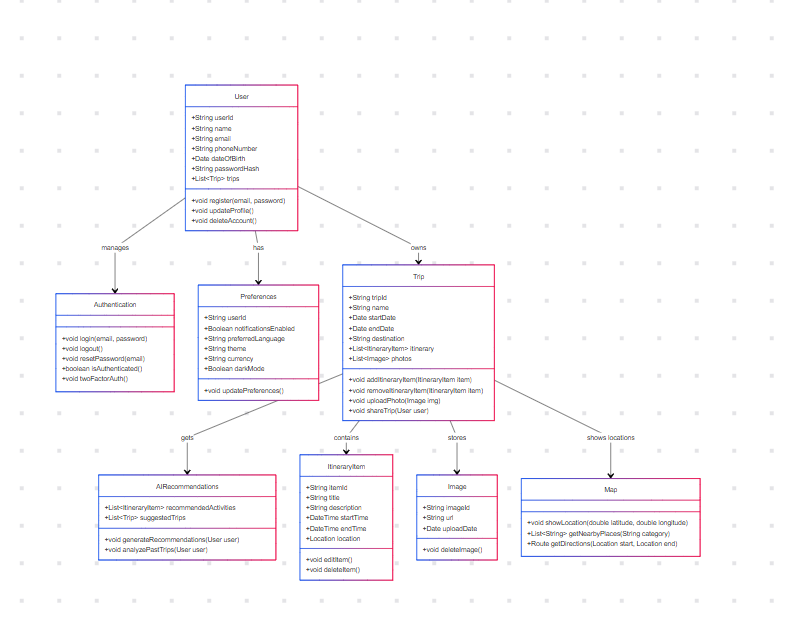

# Travel Planner - Diseño del Sistema

## Resumen
La aplicación **Travel Planner** está diseñada para ayudar a los usuarios a planificar viajes, gestionar itinerarios y colaborar con otros. Incluye funciones como recomendaciones de viajes, autenticación y servicios de mapas.

## Diagrama de Clases
El sistema sigue un enfoque **orientado a objetos**, con clases clave que representan usuarios, viajes, elementos del itinerario y entidades de soporte adicionales.

### Componentes Principales:

### 1. **Usuario (User)**
- Representa un usuario registrado.
- Almacena detalles personales y una lista de viajes.
- Puede actualizar su perfil, registrarse y eliminar su cuenta.

### 2. **Autenticación (Authentication)**
- Administra el inicio y cierre de sesión del usuario, así como la recuperación de contraseña.
- Soporta autenticación de dos factores.

### 3. **Preferencias (Preferences)**
- Almacena configuraciones específicas del usuario, como idioma, tema y preferencias de notificaciones.

### 4. **Viaje (Trip)**
- Representa un viaje planificado.
- Almacena detalles del viaje, elementos del itinerario e imágenes subidas.
- Permite compartir viajes con colaboradores.

### 5. **Recomendaciones de IA (AIRecommendations)**
- Proporciona actividades recomendadas y viajes sugeridos basados en el historial del usuario.

### 6. **Elemento del Itinerario (ItineraryItem)**
- Representa un evento o actividad dentro de un viaje.
- Incluye detalles como título, hora, ubicación y descripción.

### 7. **Imagen (Image)**
- Almacena imágenes relacionadas con los viajes.

### 8. **Mapa (Map)**
- Proporciona servicios basados en ubicación, incluyendo navegación y lugares cercanos.

## Relaciones:
- **Usuario** tiene preferencias y gestiona la autenticación.
- **Usuario** posee múltiples viajes.
- **Viaje** contiene elementos de itinerario y almacena imágenes.
- **Recomendaciones de IA** sugiere actividades y viajes.
- **Mapa** ayuda a mostrar ubicaciones y direcciones.

## Decisiones Arquitectónicas

### 1. **Arquitectura Orientada a Objetos (OOP)**
Se eligió un diseño basado en clases para modularizar el sistema y representar las entidades principales de manera clara y reutilizable. Cada clase encapsula datos y funcionalidades específicas, facilitando la escalabilidad y el mantenimiento.

### 2. **Modularidad y Separación de Responsabilidades**
Cada clase se centra en una única responsabilidad, lo que permite modificar o mejorar funcionalidades sin afectar otras partes del sistema. Esto sigue el principio SOLID de diseño de software.

### 3. **Escalabilidad y Extensibilidad**
El diseño permite agregar nuevas funcionalidades en el futuro, como un sistema de presupuesto o integración con servicios externos (API de mapas, clima, etc.).

### 4. **Recomendaciones de IA**
La inclusión de inteligencia artificial para sugerir actividades y viajes proporciona una experiencia personalizada basada en el historial del usuario y preferencias pasadas.

### 5. **Uso de Listas para Relacionar Entidades**
Se utilizan listas para modelar relaciones de uno a muchos, por ejemplo, un usuario con múltiples viajes o un viaje con múltiples elementos de itinerario. Esto simplifica la gestión de datos en la aplicación.

### 6. **Posibilidad de Integración con Bases de Datos**
El sistema está diseñado de manera que cada entidad pueda mapearse fácilmente a una base de datos relacional o NoSQL en el futuro.

## Estructura del Proyecto en Android Studio

**Estructura MVVM + Modular**
- `Model`: Maneja los datos y la lógica de negocio (ej. clases como `User`, `Trip`).
- `View`: Maneja la UI (archivos XML y Activities/Fragments en Kotlin o Java).
- `ViewModel`: Maneja la lógica de presentación y sobrevive a cambios de configuración.
- Se separa el proyecto en diferentes módulos (app, core, features).
- Facilita la escalabilidad y permite la reutilización de código.

## Mejoras Futuras
- **Gestión de Presupuesto**: Agregar seguimiento financiero a los viajes.
- **Colaboradores**: Permitir que varios usuarios editen viajes.
- **Modo Offline**: Habilitar acceso a los viajes sin conexión a internet.

# FlyHigh App - Diseño de la Base de Datos

Este documento describe el esquema de la base de datos utilizado en la aplicación FlyHigh. Detalla las tablas, sus columnas, las relaciones entre ellas y cómo se utilizan en la lógica de la aplicación.

## Esquema de la Base de Datos

La aplicación FlyHigh utiliza una base de datos Room para almacenar los datos localmente en el dispositivo del usuario. La base de datos consta de las siguientes tablas:

### 1. Tabla `TripEntity`

*   **Propósito:** Almacena información sobre cada viaje creado por el usuario.
*   **Nombre de la Tabla:** `TripEntity`
*   **Columnas:**

| Columna        | Tipo de Dato | Restricciones                       | Descripción                                               |
| -------------- | -------------- | ---------------------------------- | --------------------------------------------------------- |
| `id`           | `INTEGER`      | Clave Primaria, Autogenerado        | Identificador único para el viaje.                          |
| `title`        | `TEXT`         | No Nulo                           | Título o nombre del viaje.                               |
| `destination`  | `TEXT`         | No Nulo                           | Destino del viaje.                                 |
| `startDate`    | `DATE`         | No Nulo                           | Fecha de inicio del viaje.                                  |
| `endDate`      | `DATE`         | No Nulo                           | Fecha de finalización del viaje.                                    |
| `description`  | `TEXT`         | Nulo Permitido                           | Una breve descripción o notas sobre el viaje.              |
| `imageUrl`     | `TEXT`         | Nulo Permitido                           | URL o ruta a una imagen asociada con el viaje.       |

### 2. Tabla `ItineraryItemEntity`

*   **Propósito:** Almacena información sobre cada elemento del itinerario asociado a un viaje.
*   **Nombre de la Tabla:** `ItineraryItemEntity`
*   **Columnas:**

| Columna       | Tipo de Dato | Restricciones                                  | Descripción                                                       |
| ------------- | -------------- | --------------------------------------------- | ----------------------------------------------------------------- |
| `id`          | `INTEGER`      | Clave Primaria, Autogenerado              | Identificador único para el elemento del itinerario.              |
| `tripId`      | `INTEGER`      | Clave Foránea que referencia a `TripEntity.id`, `CASCADE` | ID del viaje al que pertenece este elemento del itinerario.              |
| `name`        | `TEXT`         | No Nulo                                             | Nombre o título del elemento del itinerario.                             |
| `description` | `TEXT`         | Nulo Permitido                                             | Una breve descripción del elemento del itinerario.                        |
| `location`    | `TEXT`         | Nulo Permitido                                             | Ubicación asociada con el elemento del itinerario.                      |
| `date`        | `DATE`         | No Nulo                                             | Fecha del elemento del itinerario.                                       |
| `startTime`   | `DATE`         | Nulo Permitido                                             | Hora de inicio del elemento del itinerario (si aplica).                |
| `endTime`     | `DATE`         | Nulo Permitido                                             | Hora de finalización del elemento del itinerario (si aplica).                  |
| `type`        | `TEXT`         | Nulo Permitido                                             | Tipo o categoría del elemento del itinerario (ej., "Vuelo", "Hotel"). |

### 3. Tabla `UserEntity`

*   **Propósito:** Almacena información sobre cada usuario.
*   **Nombre de la Tabla:** `UserEntity`
*   **Columnas:**

| Columna | Tipo de Dato | Restricciones                | Descripción                    |
| ------- | --------- | ---------------------------- | ------------------------------ |
| `id`      | `INTEGER`   | Clave Primaria, Autogenerado | Identificador único del usuario |
| `name`    | `TEXT`      | No Nulo                     | Nombre del usuario             |
| `email`   | `TEXT`      | No Nulo                     | Dirección de correo del usuario |

## Relaciones

*   **Uno a Muchos:** Un `TripEntity` puede tener múltiples entradas de `ItineraryItemEntity`, pero cada `ItineraryItemEntity` pertenece a un solo `TripEntity`.
*   **Clave Foránea:** La columna `tripId` en `ItineraryItemEntity` es una clave foránea que referencia la columna `id` en `TripEntity`. Esta relación está configurada con `ON DELETE CASCADE`, lo que significa que si se elimina un viaje, todos sus elementos del itinerario asociados también se eliminarán.

## Objetos de Acceso a Datos (DAOs)

La aplicación FlyHigh utiliza Objetos de Acceso a Datos (DAOs) para interactuar con la base de datos. Los DAOs son responsables de encapsular la lógica de acceso a la base de datos y proporcionar una capa de abstracción sobre la base de datos Room subyacente.

### `TripDao`

*   **Propósito:** Proporciona métodos para interactuar con la tabla `TripEntity`.
*   **Métodos:**
    *   `getAllTrips()`: Devuelve un `Flow<List<TripEntity>>` con todos los viajes.
    *   `getTripById(tripId: Long)`: Devuelve un `Flow<TripEntity?>` con el viaje que coincide con el id.
    *   `insertTrip(trip: TripEntity)`: Inserta un nuevo viaje en la base de datos.
    *   `updateTrip(trip: TripEntity)`: Actualiza un viaje existente en la base de datos.
    *   `deleteTripById(tripId: Long)`: Elimina un viaje de la base de datos por su ID.

### `ItineraryItemDao`

*   **Propósito:** Proporciona métodos para interactuar con la tabla `ItineraryItemEntity`.
*   **Métodos:**
    *   `getAllItineraryItems()`: Devuelve un `Flow<List<ItineraryItemEntity>>` con todos los elementos del itinerario.
    *   `getItineraryItemById(itineraryId: Long)`: Devuelve un `Flow<ItineraryItemEntity?>` con el elemento del itinerario que coincide con el id.
    *   `insertItineraryItem(itineraryItem: ItineraryItemEntity)`: Inserta un nuevo elemento del itinerario en la base de datos.
    *   `updateItineraryItem(itineraryItem: ItineraryItemEntity)`: Actualiza un elemento del itinerario existente en la base de datos.
    *   `getItinerariesByTripId(tripId: Long)`: Devuelve un `Flow<List<ItineraryItemEntity>>` de todos los elementos del itinerario asociados a un ID de viaje dado.
    *   `deleteItineraryItemById(itineraryId: Long)`: Elimina un elemento del itinerario de la base de datos por su ID.

## Convertidores de Tipos

Para manejar tipos de datos complejos, la aplicación utiliza Convertidores de Tipos. Estos se utilizan para convertir tipos de datos personalizados en un formato que Room pueda almacenar y recuperar.

*   **`UserConverter`**: Gestiona la conversión del objeto `UserEntity` a una cadena que puede almacenarse en la base de datos, y viceversa.
*   **`DateConverter`**: Se utiliza para convertir entre objetos `Date` y valores `Long`.
*   **`MapConverter`**: Se utiliza para convertir entre objetos `Map` y cadenas.
*   **`ImageListConverter`**: Se utiliza para convertir entre objetos `List<String>` y cadenas.
*   **`ItineraryItemListConverter`**: Se utiliza para convertir entre objetos `List<ItineraryItemEntity>` y cadenas.
*   **`AIRecommendationsListConverter`**: Se utiliza para convertir entre objetos `List<AIRecommendationEntity>` y cadenas.

## Uso

### Añadir un Nuevo Viaje
Crear un nuevo objeto TripEntity val newTrip = TripEntity( title = "Mi Viaje", destination = "París", startDate = Date(), endDate = Date(), description = "Un viaje a París", imageUrl = null ) // Usar el TripDao para insertar el viaje tripDao.insertTrip(newTrip) 

### Actualizar un Elemento de Itinerario Existente
Obtener el elemento del itinerario por su ID (si es necesario) val itineraryItemFlow: Flow<ItineraryItemEntity? >  = itineraryItemDao.getItineraryItemById( itineraryId)  itineraryItemFlow.collect { existingItem -> existingItem?.let { // Crear una copia del elemento existente con los detalles actual

Este documento describe la estructura principal y las interacciones dentro de la aplicación **Travel Planner**, asegurando una arquitectura bien definida para su desarrollo futuro.

